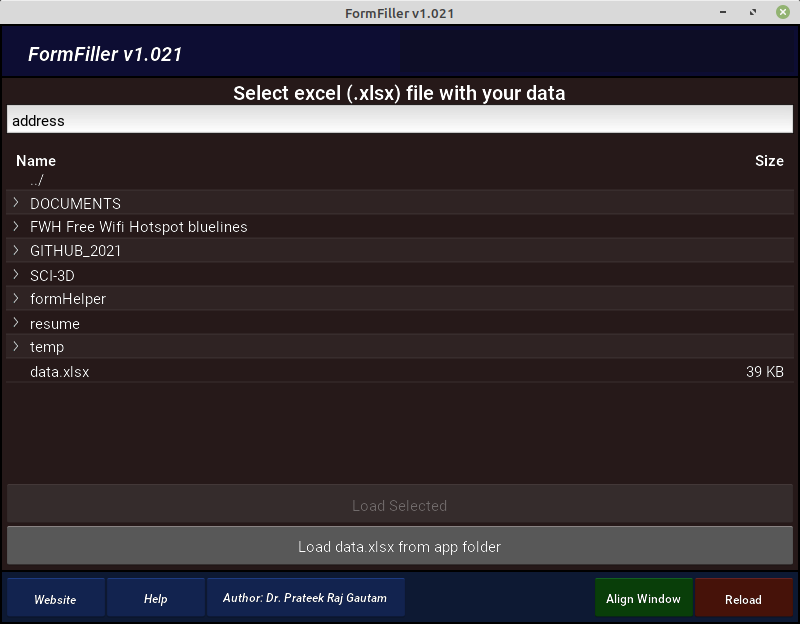
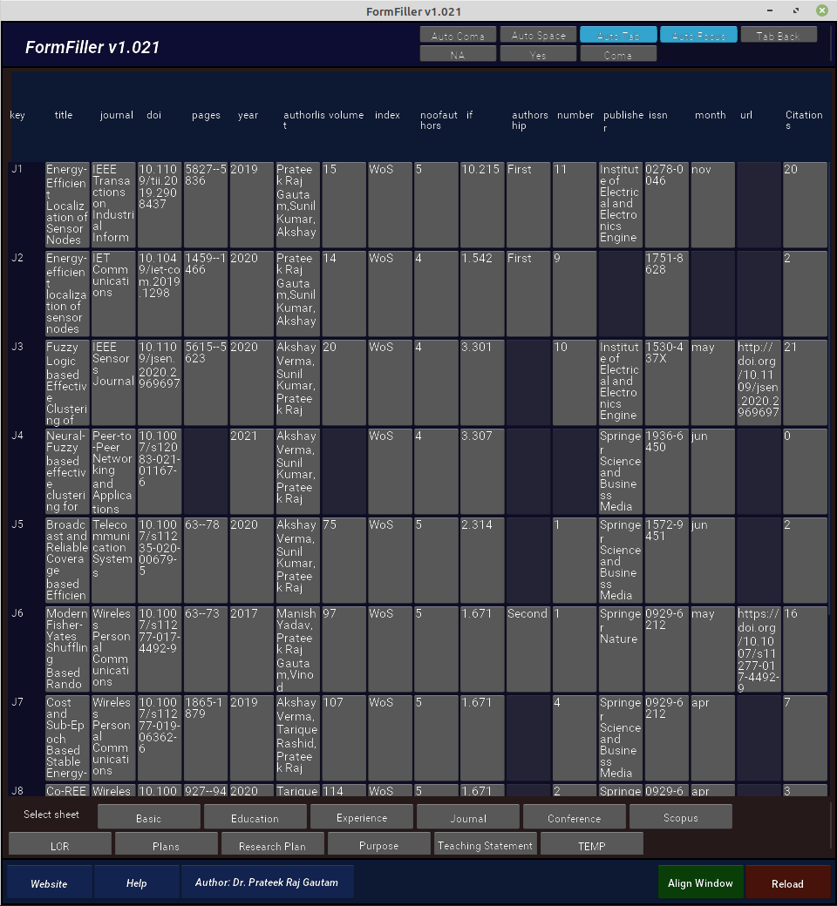

<!-- Add icon library -->
<link rel="stylesheet" href="https://cdnjs.cloudflare.com/ajax/libs/font-awesome/4.7.0/css/font-awesome.min.css">

# FormHelper.mgeek.in

# Download

<!-- Auto width -->
<a href="./assets/release/FormHelperBetaRelease.zip" download="FormHelperBetaRelease.zip"><button class="btn"><i class="fa fa-download"></i> Beta Release</button></a>

# Instructions

Just load your data filled excel and formhelper and it will convert your data in to buttons. These buttons will type data in form for you. Different sheets can be selected from the botom.

#### Steps 

1. Open your form where data needs to be filled
2. press the align button to move form window and formhelper in side by side
3. Load your data file (*.xlsx) in form helper 
4. Select the type area of form then click click on button to fill it with data.

## Screenshots

